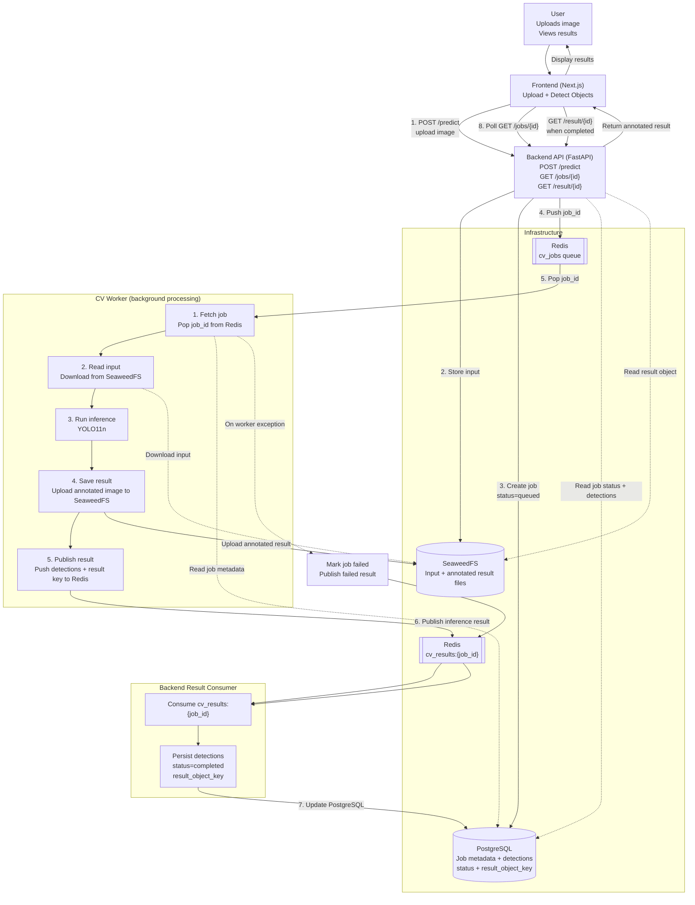

# System Architecture

```mermaid
flowchart TB
    User["User<br/>Uploads image<br/>Views results"]
    FE["Frontend (Next.js)<br/>Upload + Detect Objects"]
    API["Backend API (FastAPI)<br/>POST /predict<br/>GET /jobs/{id}<br/>GET /result/{id}"]

    subgraph Infra["Infrastructure"]
        S3[("SeaweedFS<br/>Input + annotated result files")]
        PG[("PostgreSQL<br/>Job metadata + detections<br/>status + result_object_key")]
        RQ[["Redis<br/>cv_jobs queue"]]
        RR[["Redis<br/>cv_results:{job_id}"]]
    end

    subgraph Worker["CV Worker (background processing)"]
        direction LR
        W1["1. Fetch job<br/>Pop job_id from Redis"]
        W2["2. Read input<br/>Download from SeaweedFS"]
        W3["3. Run inference<br/>YOLO11n"]
        W4["4. Save result<br/>Upload annotated image to SeaweedFS"]
        W5["5. Publish result<br/>Push detections + result key to Redis"]
        W1 --> W2 --> W3 --> W4 --> W5
    end

    subgraph Consumer["Backend Result Consumer"]
        C1["Consume cv_results:{job_id}"]
        C2["Persist detections<br/>status=completed<br/>result_object_key"]
        C1 --> C2
    end

    User --> FE
    FE -->|"1. POST /predict<br/>upload image"| API
    API -->|"2. Store input"| S3
    API -->|"3. Create job<br/>status=queued"| PG
    API -->|"4. Push job_id"| RQ

    RQ -->|"5. Pop job_id"| W1
    W1 -.->|"Read job metadata"| PG
    W2 -.->|"Download input"| S3
    W4 -->|"Upload annotated result"| S3
    W5 -->|"6. Publish inference result"| RR
    RR --> C1
    C2 -->|"7. Update PostgreSQL"| PG

    FE -->|"8. Poll GET /jobs/{id}"| API
    API -.->|"Read job status + detections"| PG
    FE -->|"GET /result/{id}<br/>when completed"| API
    API -.->|"Read result object"| S3
    API -->|"Return annotated result"| FE
    FE -->|"Display results"| User

    W1 -.->|"On worker exception"| F["Mark job failed<br/>Publish failed result"]
    F --> RR
    RR --> C1
```
